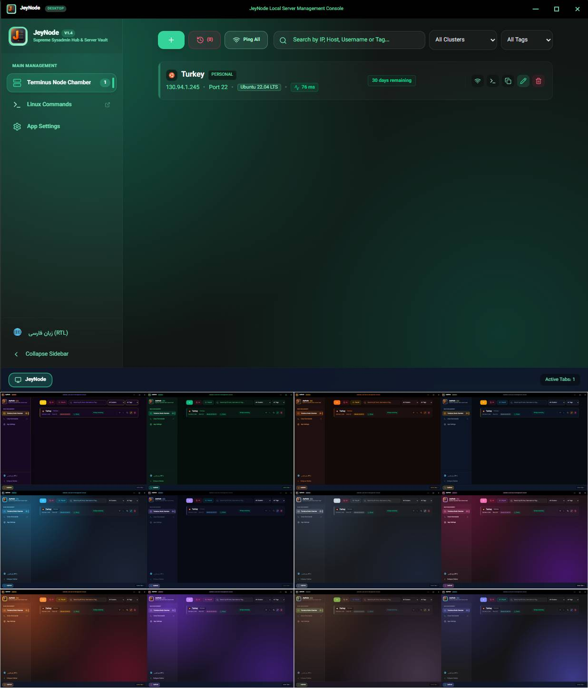
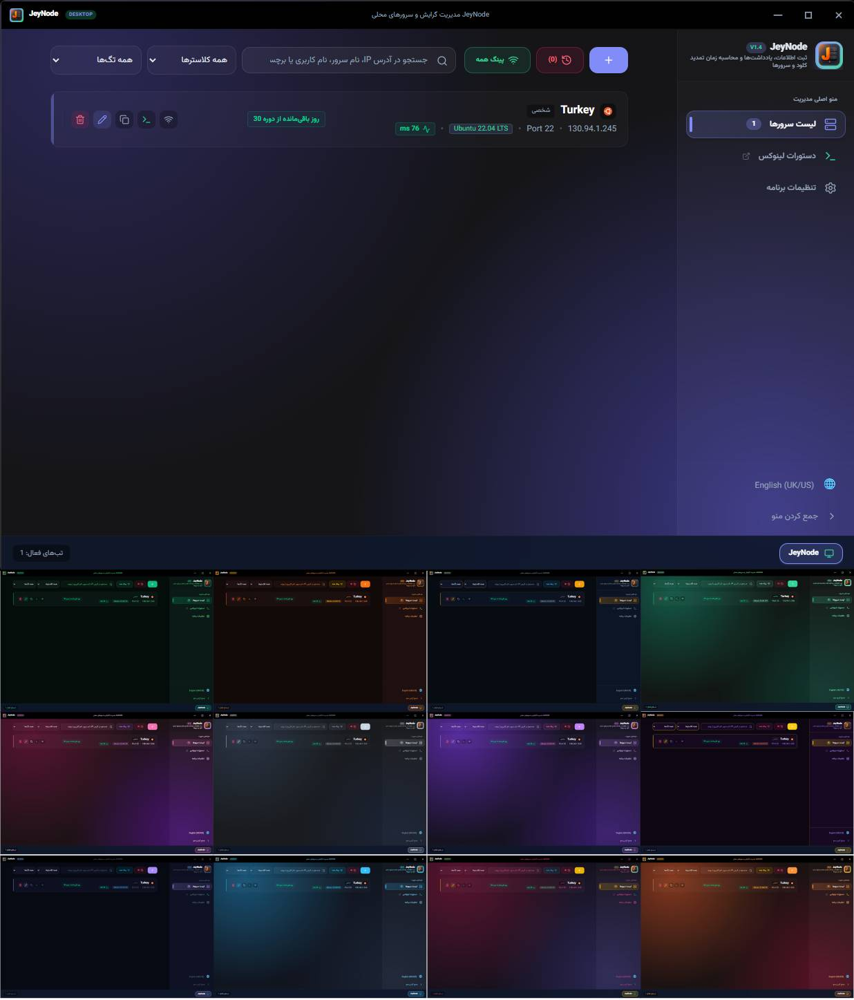

# JeyNode (جی‌نود) - Premium Server & SSH Management Console

[English](#english) | [فارسی](#persian)

---

## English

**JeyNode** is a premium, secure, and modern Cross-Platform Desktop Application (Windows, macOS, Linux) designed for developers and system administrators to manage remote servers and SSH connections beautifully. 

Featuring active visual stat dashboards, interactive interactive terminal tabs, and cryptographic PIN security vaults, JeyNode combines administrative power with a high-end, responsive system console workspace.

### Key Features
*   🖥️ **Interactive SSH Terminal Client**: Execute commands directly via a custom, fully themes-ready SSH terminal. Fully supports responsive commands, inline outputs, and context menu-driven copy/paste.
*   📊 **Real-time Server Monitor (Htop mode)**: Simulates running and tracking system utilization (CPU/RAM metrics) with high-fidelity visualization.
*   🔒 **Cryptographic PIN Protection (Security Vault)**: Lock active terminal sessions and server configurations with a 4-digit physical barrier PIN code.
*   🌐 **Bilingual Workspace**: Smooth on-the-fly toggling between English (LTR) and Persian/Farsi (RTL) with fully localized interactive texts.
*   ⚡ **Tauri-Powered Core**: Blazing fast, lightweight memory footprint, built with React, Vite, Tailwind CSS, and Tauri v2.

---

---

## فارسی

**جی‌نود (JeyNode)** یک نرم‌افزار دسکتاپ مدرن، امن و چندسکویی (ویندوز، مک، لینوکس) است که به طور ویژه برای توسعه‌دهندگان و مدیران سیستم جهت مدیریت سرورها و اتصالات SSH طراحی شده است. 

این برنامه با دارا بودن داشبورد بصری منابع سیستم، تب‌های ترمینال تعاملی هوشمند و صندوقچه امنیتی قفل رمزنگاری‌شده (PIN)، قدرت مدیریت همه‌جانبه سرور را همراه با تجربه کاربری روان و بهینه به ارمغان می‌آورد.

### قابلیت‌های کلیدی
*   🖥️ **کلاینت تعاملی ترمینال SSH**: اجرای مستقیم دستورات از طریق شبیه‌ساز ترمینال SSH پیشرفته با قابلیت ست کردن تم، کپی و پیست سریع از کلیک راست و پردازش آنی خطوط.
*   📊 **مانیتور آنی منابع سرور (htop)**: شبیه‌سازی دقیق و پویا از درصد دیسک فعال، پردازنده (CPU) و رم (RAM) سرورها.
*   🔒 **سپر امنیتی صندوچه رمز عبور (PIN)**: امکان تنظیم فیزیکی دیواره قفل عددی ۴ رقمی روی سشن‌های فعال کارتابل برای محافظت از اطلاعات اتصال‌ها.
*   🌐 **داشبورد کاملاً دوزبانه**: سوییچ آنی و روان بین زبان‌های فارسی (راست‌چین کامل) و انگلیسی (چپ‌چین منحصربه‌فرد) با بومی‌سازی صددرصدی متون.
*   ⚡ **هسته بهینه و پرسرعت**: توسعه‌یافته بر پایه React، تایلوند نسخه ۴ و فریم‌ورک قدرتمند Tauri v2 با حجم مصرفی فوق‌العاده کم از رم کامیپوتر.

---

